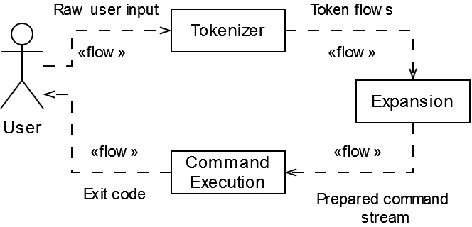
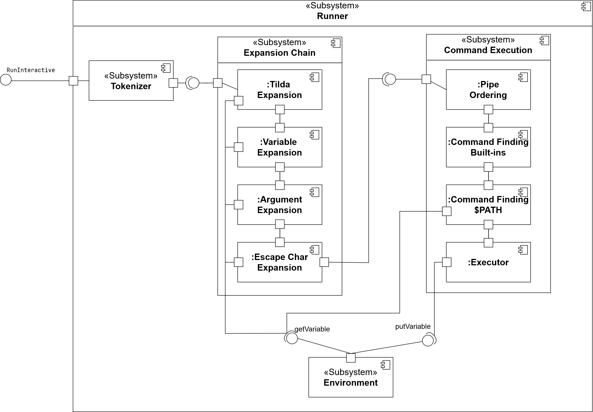
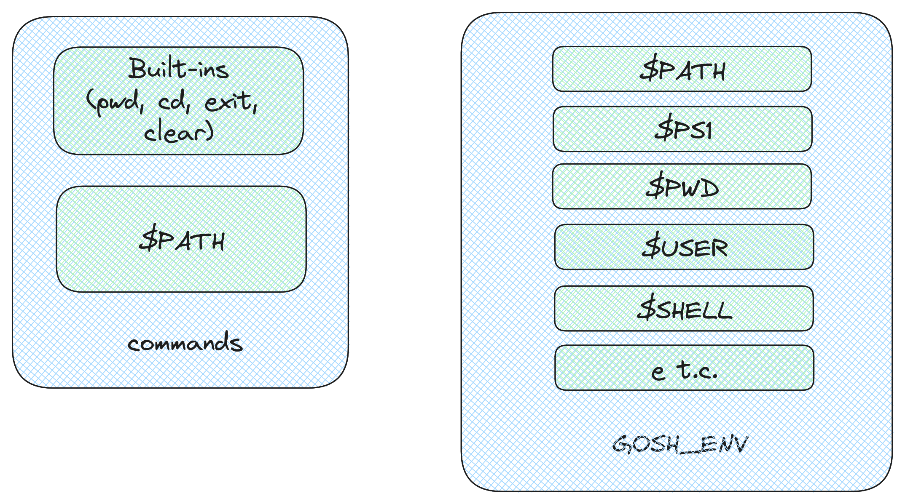
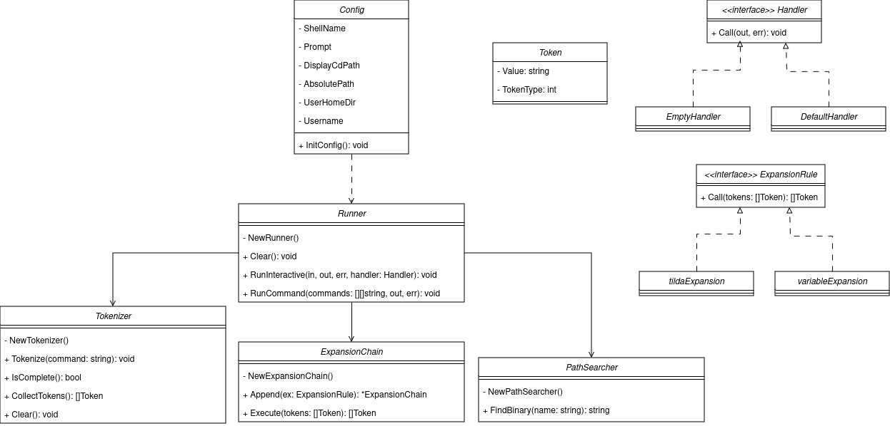
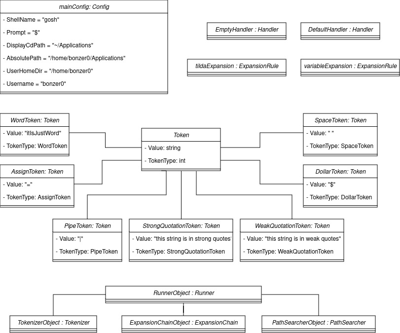

# Oh My GOSH
Реализация простого shell на языке Go

## Документы по архитектуре проекта

Рассмотрим поток данных, который происходит во время исполнения приложения.
Запрос пользователя проходит через все стадии, после чего в переменную окружения устанавливается
результат исполнения последней команды.

Рассмотрим то, как выглядят запускаемые компоненты.
Существует функция `RunInteractive` находящаяся в модуле `Runner`, запускающая программу на исполнение
в цикле.

Диаграмма компонентов со связями между ними изображена ниже

В `gosh` есть два ключевых компонента - команды и переменные окружения
Команды также делятся на два компонента - встроенные и те, что доступны через `PATH`

Сам же `PATH` и другие переменные как раз и лежат в переменных окружения

Диаграмма классов проекта

Диаграмма объектов

